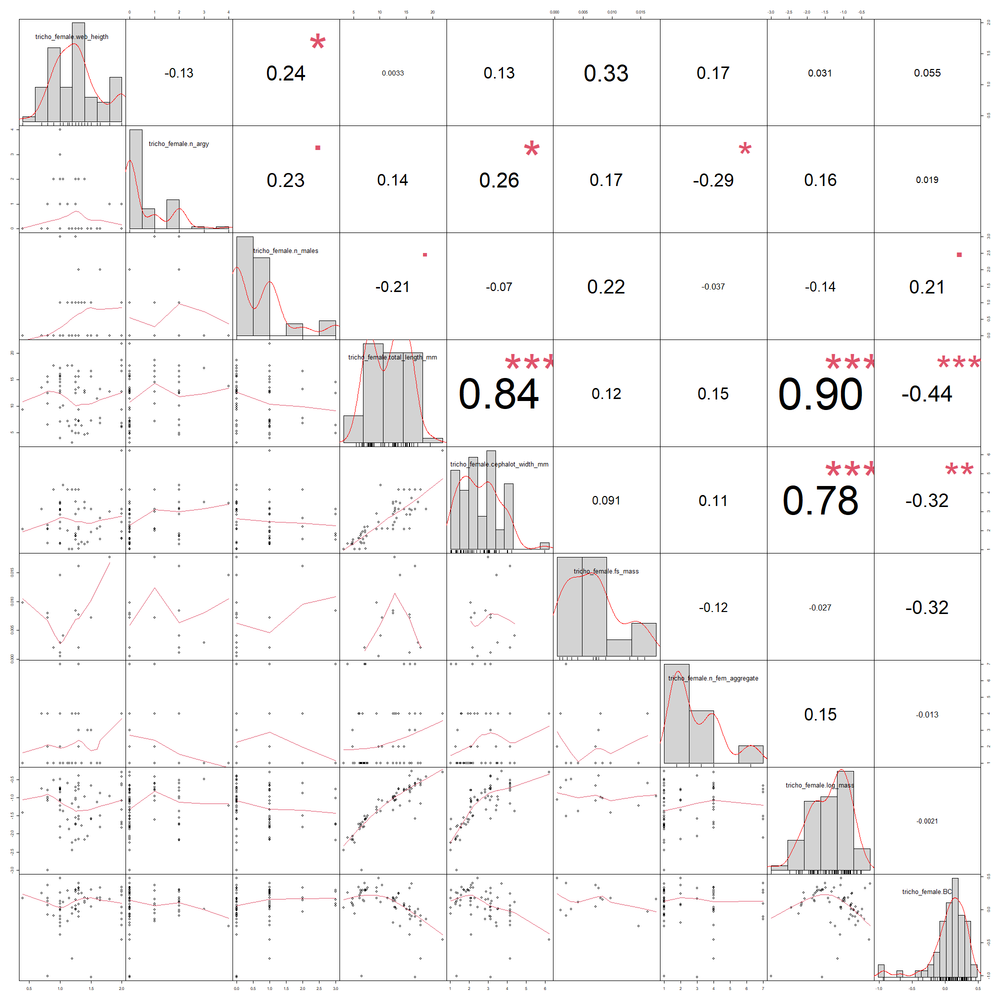
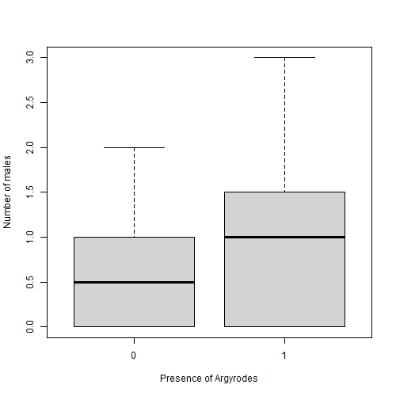
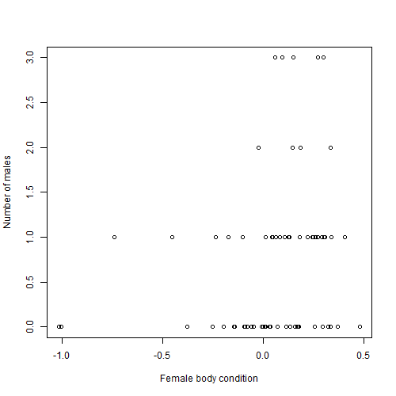
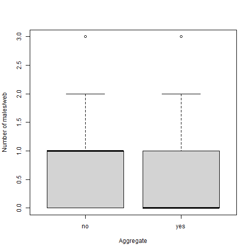

```{r setup, include=FALSE}
knitr::opts_chunk$set(echo = TRUE)
knitr::opts_chunk$set(fig.pos = 'H')
```

## Introduction

Belonging to the family Araneidae, the species *Trichonephila clavipes* is distributed from the South of the United States and extends to Argentina, being well adapted to the urban environment [@Robinson1971]. The females of these spiders build big, elaborated and symmetrical webs, sometimes reaching one meter in diameter. The sticky silk of their web is known for its great resistance, which causes many insects and even small birds to be captured by the web. The abundance of food in their webs does not benefit only the *T. clavipes* females. Smaller males of *T. clavipes* and kleptoparasites, such as spiders of the subfamily Argyrodinae (Theridiidae) [@Silveira2012], can be seen in their webs.

With strong size sexual dimorphism favoring females (females > males), the T. clavipes spiders have a polyandrous mating system (one female with several males), wich can be extremely advantageous. Compared to females that copulate with fewer males, polyandry may result in offspring with greater genetic diversity [@Hosken2003]. There abundance of males per web can vary, and although there isn't a clear answer to why we can find more males in a web than in others, in other spider taxa, males exhibit preferences for larger females (Hoefler, 1994), due to their body condition being related to their ability to carry eggs.

Moreover, females of the species *Trichonephila clavipes* are known to group together in clusters of interconnected webs. In spiders, clustering behavior increases foraging efficiency, habitat exploration, location of males, and protection from predators and parasites [@Lubin1974; @Buskirk1975; @Rypstra1981; @Brach1977].

The females of *T. clavipes* also have a behavior of combining parts of previous meals with their web, and making a string that stays allocated in the center of their web. It is unclear the purpose of this behavior and the ramifications of it, and if its presence or absence affects the females and males of T. nephila, and the kleptoparasites present in the web.

Given that, the objective of this research is to understand what factors influence the amount of *T. clavipes* males in one web. Consecutively, my hypothesis are that: (1) The amount of males in a single web is related to the body conditions of the female. (2) The presence of Argyrodes repels males of T. clavipes and vice-versa.

## Material and Methods

### Data sampling

The present study was conducted over five days in February 2020, at Fazenda Água Limpa, Brasília - DF, and four days at the Instituto de Biologia (IB). All spiders that were in the main web of the female Trichonephila clavipes were collected, as well as the food strings. The following information was collected: spider identification (collectors' initials + spider number), whether the females were in aggregates or not, the quantity of webs (in case of aggregates), time, location, the amount of Trichonephila clavipes males, the amount of Argyrodes spp, amount of female Trichonephila clavipes found in the cluster, web height, presence of a food string, presence of any other tenant in the web not identified at the time, and whether any spiders were feeding at the time of observation. In the laboratory, the food strings were weighted and morphological parameters of all spiders collected in the field were measured. For females of T. clavipes, we measured the width of the cephalothorax, as well as the total length from the beginning of the cephalothorax to the end of the abdomen. For males of T. clavipes, and other tenants, only the total length was measured. All arachnids were weighed alive on the same day they were collected.

### Data analysis

The dataset generated at the end of the summer course was edited and cleaned in R. An exploratory data analysis was made to understand the overall patterns in our data. I utilized the "chart.Correlation' function from the "PerformanceAnalytics" to see any possible correlations present in our numerical variables. To check possible interactions between qualitative variables, several boxplots with variables that possibly could be correlated was plotted.

```{r cars, echo=FALSE, fig.cap = " Correlations between the numerical variables found in our dataset. The only meaningful correlations found were between the measurements of the female T. clavipes, which are not important to our present study",out.width=400, out.extra=''} 

```

Subsequently, I used generalized linear models (GLM) to analyze the relationships between the number of males in a web with the Trichonephila clavipes females parameters, as well as the spatial parameters (such as the presence of a food string, and if the web part of an aggregate). Since our response variable (number of males) has a discrete distribution, I choose the Poisson fit for the GLM. The best model was chosen by the Akaike Information Criterion (AIC), and the selected model was validated, using dispersion and deviation tests, multicollinearity and overdispersion. parameters.

## Results

Out of 15 models, six showed a delta AIC smaller than 2. Even though I cannot discard models with dAIC<2, I will focus in the two models that had a dAIC < 1, tcglm3 and tcglm11. Both of them fitted the asssumptions for a GLM.

```{r table, echo=FALSE, Table = "AIC, delta AIC and weights information for each GLM"}
tcAIC <- read.csv("../data/processed/tcAIC.csv")
knitr::kable(tcAIC, caption = "AIC, delta AIC and weights information for each GLM")
```


The first model (tcglm3) takes in consideration presence of Argyrodes, the body condition of the females and if the web that the male is in is part of an aggregate of webs or not. The second model (tcglm11), although it has a higher delta AIC, it has one less parameter, female body condition, than the model with smallest dAIC.

Both models present that the number of males increases with the presence of Argyrodes, and decreases with if the web is part of an aggregate. The model with the smallest dAIC also portrays a posite correlation between the number of males and the body condition of the female found in the web.

```{r final, echo=FALSE, fig.cap = "Correlations between the categorical variables present in the slected models and the presence of males. First: Relation between number of males per web and presence of Argyrodes. Second: Number of males and female body condition. Third: Number of males and if thy are in a aggregate web or a single web. ", out.width="30%",out.height="30%",fig.show='hold', fig.align='center'}
par(mfrow= c(2,2))




```

## Discussion

Coinciding with previous studies about *Trichonephila clavipes* [@Vincent2006], there seem to be preference by the males for the females with a higher body condition. However, our hypothesis that the males would prefer webs with less Argyrodes was proven wrong. Although territorialists between themselves [@Christenson1979], the males not only coexist with other spider species on the female webs, but their numbers increase if there were Argyrodes present in the web. We can assume that their territorialism arises from intraespecific competition for the female, and not from interespecific competition for resources. In addition, future anlysis could be done to see if the number of Argyrodes in a web is also positively correlated to their body sizes.

Although we can see some patterns, we would need posterior statistical analysis to confirm the correlations previously discussed. Moreover, it would be necessary further field work and data sampling, given that the original table doesn't have a big number of observations and it's filled with NAs. However, with this small analysis, we can observe the general patterns regarding the abundance of males *T.clavipes* in a web.

## References
